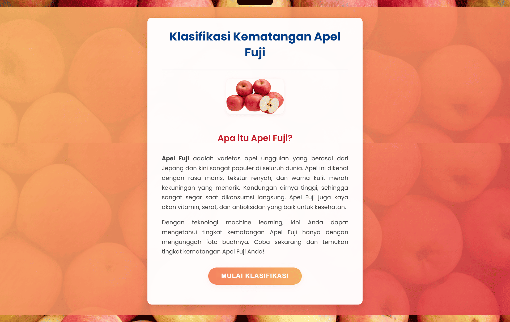
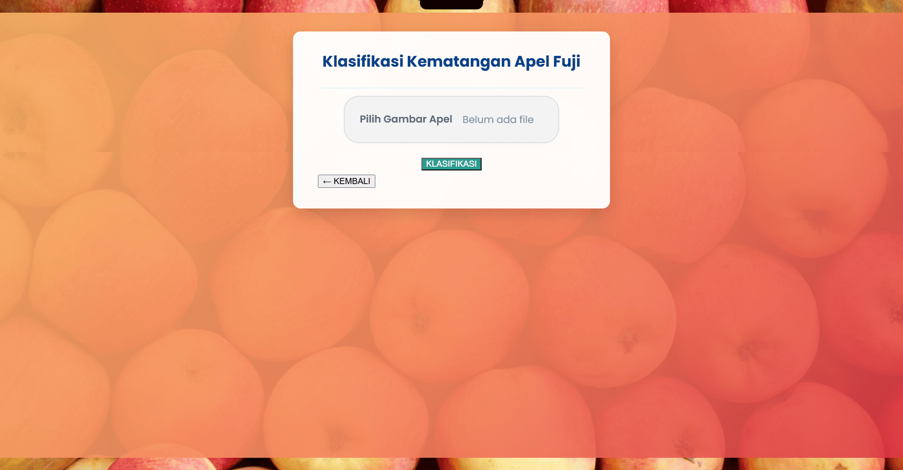
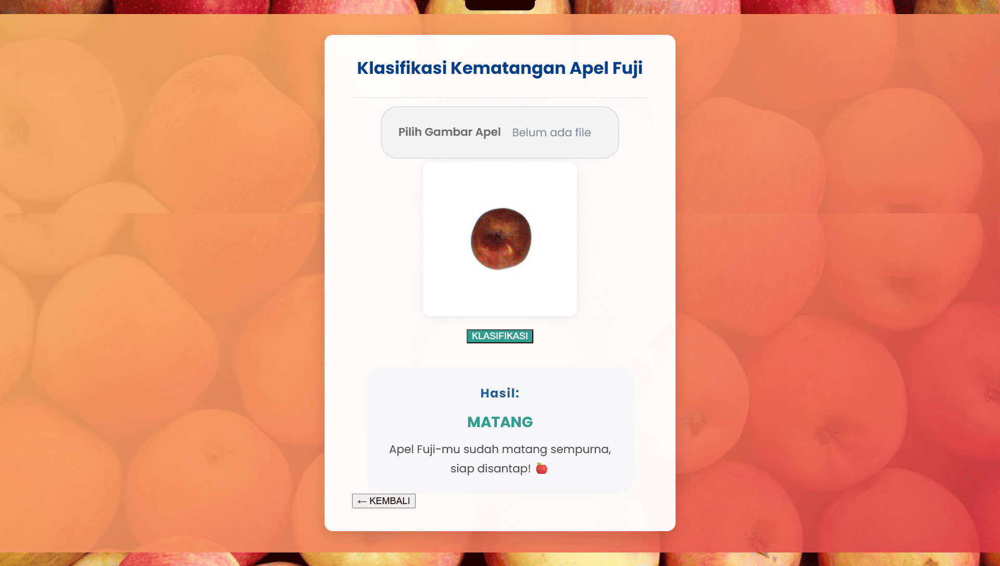
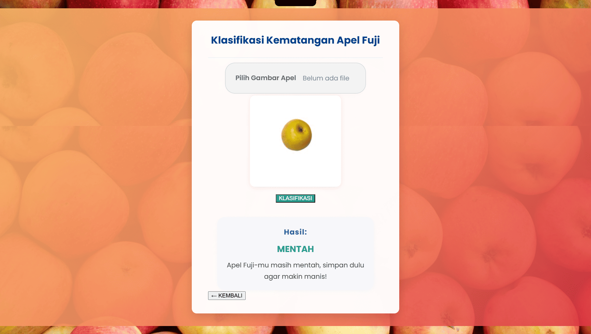

# Klasifikasi Kematangan Apel Fuji

Aplikasi web untuk mengklasifikasikan tingkat kematangan apel Fuji berdasarkan analisis warna gambar.

## Fitur

- Klasifikasi 3 kategori: **Mentah**, **Setengah Matang**, **Matang**
- Rule-based classification dengan KNN sebagai fallback
- Web interface sederhana untuk upload gambar
- Dataset 240 gambar apel Fuji (80 per kategori)

## Teknologi

- **Python Flask** - Web framework
- **OpenCV** - Image processing
- **Scikit-learn** - K-Nearest Neighbor (KNN)
- **HTML/CSS** - Frontend

## Instalasi

1. Install dependencies:

   ```bash
   pip install -r requirements.txt
   ```

2. Jalankan aplikasi:

   ```bash
   python app.py
   ```

3. Buka browser: `http://localhost:5000`

## Cara Penggunaan

1. Upload gambar apel Fuji (JPG/PNG)
2. Klik tombol "KLASIFIKASI"
3. Lihat hasil klasifikasi

## Screenshots

### Halaman Utama


### Halaman Klasifikasi


### Hasil Klasifikasi - Apel Matang


### Hasil Klasifikasi - Apel Mentah


## Algoritma

Menggunakan ekstraksi fitur warna (RGB + HSV) dengan rule-based classification:

- **Mentah**: MeanG > 0.960 dan MeanS < 0.080
- **Matang**: MeanG < 0.910 atau (MeanG < 0.920 dan MeanS > 0.085)
- **Setengah Matang**: Fallback ke KNN jika tidak memenuhi rule di atas
